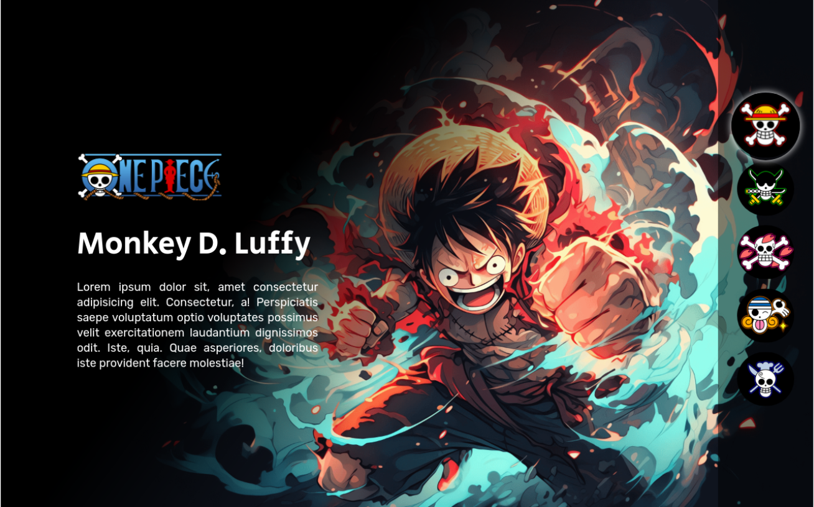

<h1 align="center">
  One Piece
</h1>

  <a href="#-projeto">Projeto</a>&nbsp;&nbsp;&nbsp;|&nbsp;&nbsp;&nbsp;
  <a href="#-tecnologias">Tecnologias</a>&nbsp;&nbsp;&nbsp;|&nbsp;&nbsp;&nbsp;
  <a href="#-layout">Layout</a>&nbsp;&nbsp;&nbsp;

  

## 💻 Projeto

Projeto de site para o mangá shōnen **One Piece** ao usar _HTML_, _CSS_ e _JAVASCRIPT_.

## 🚀 Tecnologias

- HTML
- CSS
- Javascript

## 📔 Conhecimentos abordados

- [x] Uso semântico do HTML
- [x] Uso do CSS Flexbox
- [x] Efeitos de responsividade

## 🔖 Layout

Você pode visualizar o projeto através [DESSE LINK](https://charles-onepiece.vercel.app/).